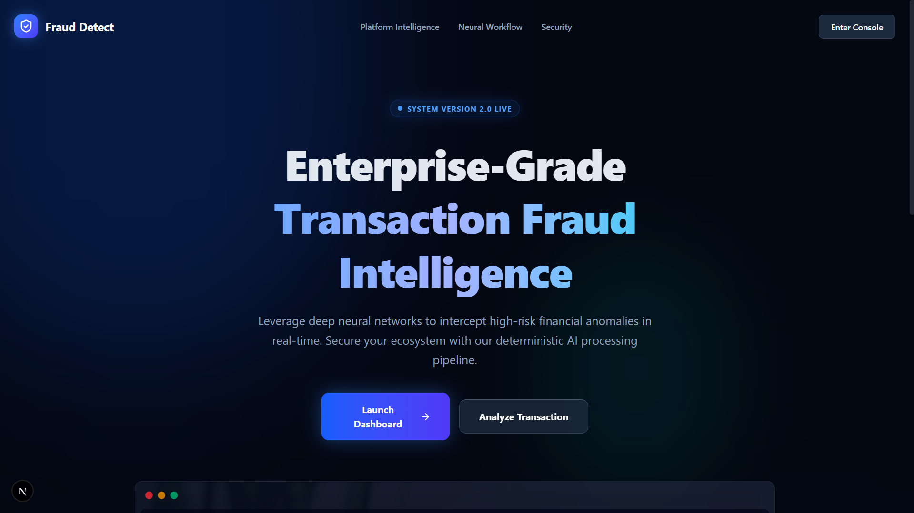
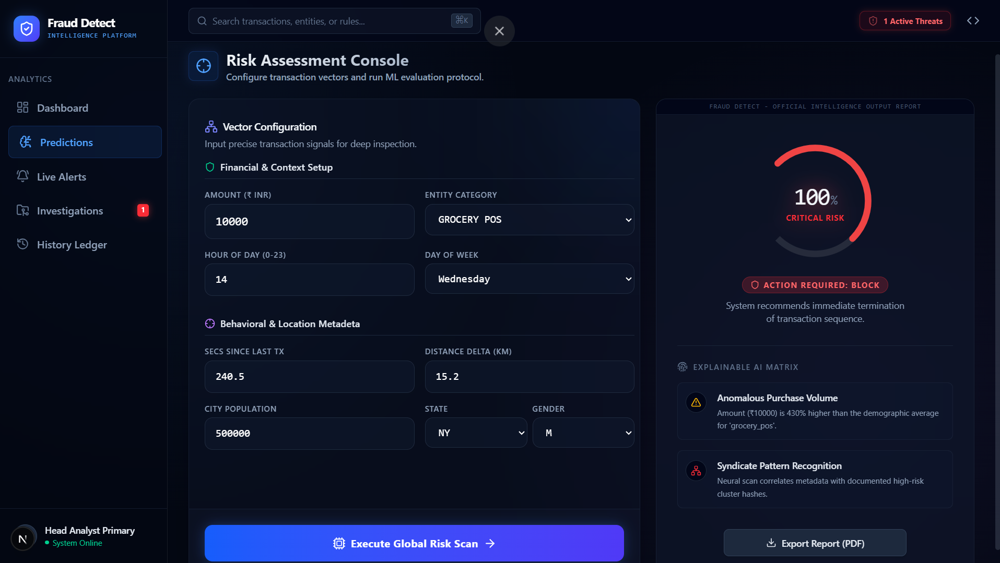
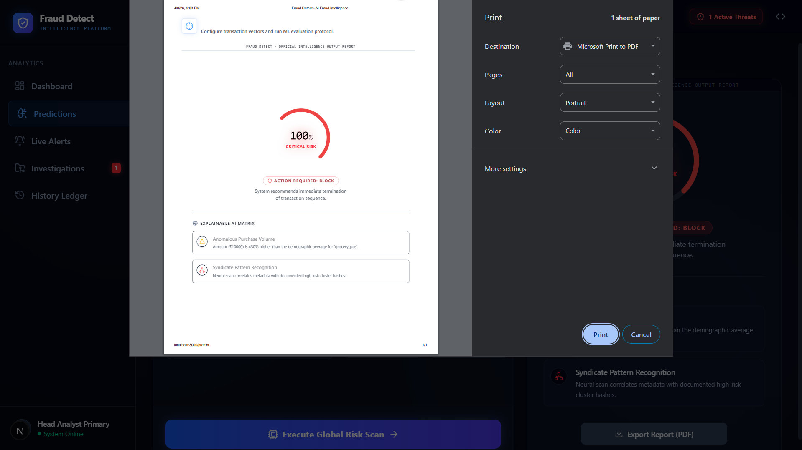
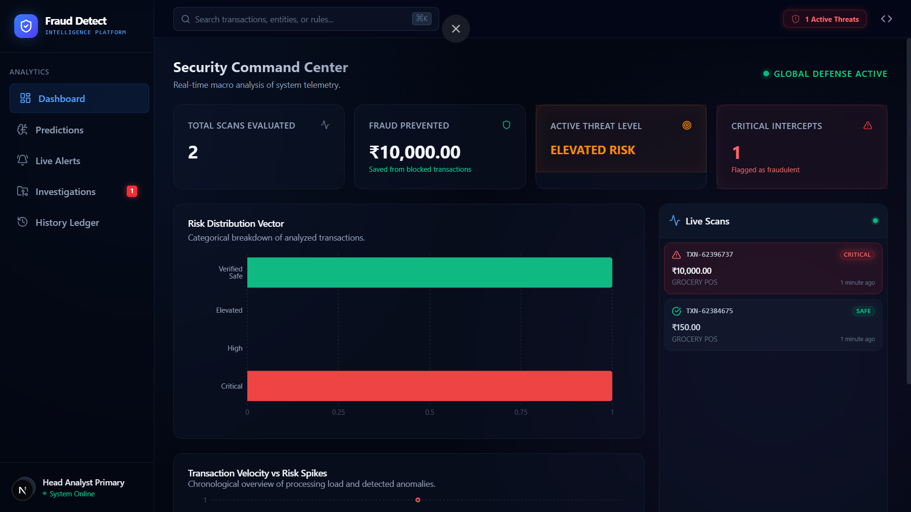
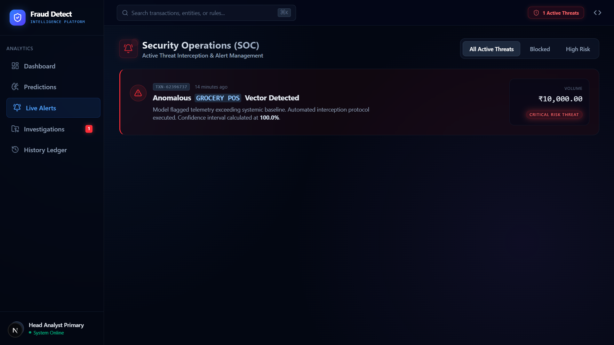
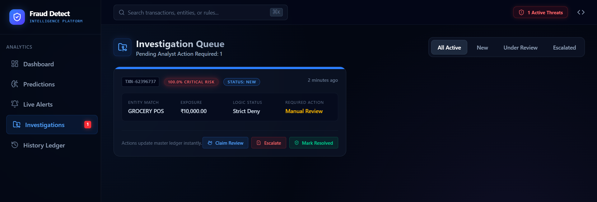

<div align="center">

# 🛡️ Fraud Detect

### ⚡ AI-Powered Fraud Intelligence & Investigation Platform

<p align="center">
  
</p>

<p align="center">
  
  
  
  
  
  
</p>

<p align="center">
  
  
  
</p>

</div>

---

# 📌 Overview

**Fraud Detect** is an end-to-end **AI-powered fraud intelligence platform** built to detect suspicious financial transactions and transform raw fraud predictions into a more realistic **fraud monitoring + investigation workflow**.

Unlike a basic fraud detection notebook, this project combines:

* **Machine Learning fraud prediction**
* **FastAPI backend integration**
* **modern frontend dashboard**
* **risk intelligence visualization**
* **live fraud alerts**
* **analytics dashboard**
* **investigation workflow**
* **exportable analyst reports**

This project is designed to simulate a **real fintech fraud operations platform** rather than just a standalone ML model.

---

# 🎯 Problem Statement

Fraudulent transactions are one of the biggest threats in digital financial systems. The challenge is not only to detect fraud, but to:

* identify suspicious patterns quickly
* surface high-risk transactions clearly
* support analyst-style review workflows
* provide meaningful insights for action
* make fraud detection usable in a real interface

Traditional ML projects often stop at prediction.

**Fraud Detect** goes further by turning fraud detection into a **product-oriented intelligence system**.

---

# 🧠 Project Objective

The main objective of this project is to build a system that can:

* predict whether a transaction is fraudulent or legitimate
* process and transform transaction data through an ML pipeline
* expose predictions through a backend API
* provide a modern dashboard-driven frontend
* generate fraud alerts based on risk conditions
* support investigation-style case workflows
* export fraud intelligence data for reporting

---

# 🏗️ System Architecture

```text
User / Analyst Input
          │
          ▼
  Fraud Detect Frontend
          │
          ▼
   FastAPI Backend API
          │
          ▼
Preprocessing + Scaling Layer
          │
          ▼
  Trained Fraud ML Model
          │
          ▼
 Prediction + Risk Scoring
          │
          ▼
 Alerts / Analytics / Cases / Reports
```

---

# ✨ Core Features

## 🔍 Fraud Intelligence Engine

* Real transaction fraud prediction
* Fraud / Safe classification
* Risk category evaluation
* AI-style suspicious pattern insights

## 📊 Fraud Monitoring Dashboard

* Premium dashboard interface
* Transaction activity overview
* Fraud vs Safe monitoring flow
* Risk-focused product experience

## 🚨 Live Alerts System

* Real alert generation from suspicious predictions
* Risk-based alert severity
* High-risk / critical case visibility
* Monitoring-style alert workflow

## 🗂️ Investigation Queue

* Dedicated case review flow
* Analyst-style transaction investigation
* Review / escalate / status workflow
* Operational fraud case management

## 📈 Analytics Layer

* Risk distribution visualization
* Fraud activity monitoring
* Transaction behavior overview
* Dashboard-style intelligence metrics

## 📄 Export & Reporting

* CSV export for transaction history
* Report export for fraud analysis
* Analyst-friendly result sharing
* Investigation-ready summaries

## 🇮🇳 INR-First Product Design

* Indian currency formatting (₹ / INR)
* Finance-oriented amount presentation
* Region-relevant fraud monitoring feel

---

# 🧰 Tech Stack

## 💻 Languages

* Python
* TypeScript / JavaScript
* HTML
* CSS

## ⚙️ Backend

* FastAPI

## 🎨 Frontend

* Next.js
* Tailwind CSS

## 🤖 Machine Learning / Data Science

* Scikit-learn
* Pandas
* NumPy
* Jupyter Notebook

## 📁 Model Artifacts

* `fraud_model.pkl`
* `scaler.pkl`
* `columns.json`
* `numerical_cols.json`

---

# 📂 Project Structure

```bash
Transaction_Fraud_Detection/
│
├── backend_api/               # FastAPI backend + fraud prediction API
├── fraud-frontend/            # Next.js frontend dashboard
├── fraud_model.pkl            # Trained ML fraud model
├── scaler.pkl                 # Saved feature scaler
├── columns.json               # Feature columns
├── numerical_cols.json        # Numerical feature metadata
├── Untitled-1.ipynb           # Model experimentation notebook
└── README.md
```

> 🔧 Recommended cleanup: rename `Untitled-1.ipynb` to something more professional like `fraud_model_training.ipynb`

---

# 📸 Platform Preview

A visual walkthrough of the **Fraud Detect Intelligence Platform**.

---

## 🏠 Landing Page

The futuristic landing experience introduces the platform as an enterprise-grade fraud intelligence system.

<p align="center">
  
</p>

---

## 🧪 Prediction Workspace

The fraud prediction console allows users to input transaction metadata and receive AI-powered fraud risk analysis in real time.

<p align="center">
  
</p>

---

## 📄 Exportable Fraud Intelligence Report

The platform supports report export for analyst review and documentation workflows.

<p align="center">
  
</p>

---

## 📊 Security Dashboard

The analytics dashboard provides high-level monitoring of transaction scans, risk distribution, and system fraud prevention metrics.

<p align="center">
  
</p>

---

## 🚨 Live Alerts Console

Suspicious transactions are surfaced through a real-time alert management interface for rapid fraud interception.

<p align="center">
  
</p>

---

## 🗂️ Investigation Queue

Flagged fraud cases are routed into an investigation workflow where analysts can review, escalate, or resolve suspicious transactions.

<p align="center">
  
</p>

---

# ⚙️ Workflow

## 1️⃣ Data Processing

* Transaction data is cleaned and transformed
* Relevant features are selected
* Numerical values are scaled before inference

## 2️⃣ Model Training

* Fraud classification model is trained using transaction behavior data
* Fraudulent vs legitimate patterns are learned through supervised ML

## 3️⃣ Model Serialization

* Trained model and preprocessing artifacts are saved for deployment

## 4️⃣ Backend API Integration

* FastAPI serves the fraud prediction endpoint
* Frontend communicates with backend for live predictions

## 5️⃣ Fraud Intelligence Layer

* Prediction output is converted into:

  * fraud status
  * risk level
  * AI insights
  * live alerts
  * case management flow

## 6️⃣ Dashboard Experience

* Analysts / users interact with the dashboard
* Transactions can be reviewed, tracked, exported, and monitored

---

# 🖥️ Product Experience

Fraud Detect is structured more like a **fraud operations platform** than a simple ML app.

## Main Product Flow

```text
Landing Page
   ↓
Dashboard Command Center
   ↓
Prediction Workspace
   ↓
Risk Intelligence Output
   ↓
Live Alerts / Investigation Queue / Analytics
```

---

# 🚀 Key Product Modules

## 🏠 3D Landing Page

A futuristic fintech-inspired landing experience introducing the platform before entering the dashboard.

## 📊 Dashboard Command Center

A central monitoring space for:

* fraud metrics
* quick actions
* activity insights
* risk overview

## 🧪 Prediction Workspace

A premium AI fraud analysis page where users can:

* submit transaction parameters
* trigger fraud analysis
* receive intelligence-style outputs

## 🚨 Live Alerts Console

A monitoring layer for suspicious and high-risk transactions.

## 🗂️ Cases / Investigation Workflow

A dedicated operational view for reviewing suspicious or escalated fraud cases.

## 📈 Analytics Dashboard

A more productized view of fraud behavior and system activity.

---

# 📸 Suggested Screenshots

> Add your real project screenshots here to make the repo much more impressive.

Recommended sections:

* `Landing Page Preview`
* `Dashboard Preview`
* `Prediction Workspace`
* `Live Alerts System`
* `Investigation Queue`
* `Analytics Dashboard`

Example:

```md
## 📸 Dashboard Preview

```

---

# 🚀 How to Run the Project

## 1. Clone the repository

```bash
git clone https://github.com/animesh6532/Transaction_Fraud_Detection.git
cd Transaction_Fraud_Detection
```

---

## 2. Create a virtual environment

```bash
python -m venv venv
```

### Activate it

**Windows**

```bash
venv\Scripts\activate
```

**Mac/Linux**

```bash
source venv/bin/activate
```

---

## 3. Install backend dependencies

```bash
pip install -r requirements.txt
```

> If your backend dependencies are inside a subfolder, install from the correct location.

---

## 4. Run the FastAPI backend

```bash
cd backend_api
uvicorn main:app --reload
```

> If your FastAPI entry file uses a different name, replace `main:app` accordingly.

---

## 5. Run the frontend

Open a new terminal:

```bash
cd fraud-frontend
npm install
npm run dev
```

Then open:

```text
http://localhost:3000
```

---

# 📡 Example Use Case

A user submits transaction-related details through the frontend.

The system then:

1. sends the data to the backend API
2. preprocesses the input
3. scales the required features
4. runs the trained fraud model
5. returns a fraud prediction
6. generates a risk interpretation
7. surfaces the result inside the fraud intelligence dashboard

Example result:

```text
Prediction: Fraudulent Transaction
Risk Level: High
Action: Manual Review Recommended
```

or

```text
Prediction: Legitimate Transaction
Risk Level: Low
Action: No Immediate Risk Detected
```

---

# 🧠 Why This Project Stands Out

This project is stronger than a standard ML fraud repo because it demonstrates:

* practical **Machine Learning deployment**
* **FastAPI + frontend integration**
* movement from **notebook to usable product**
* product thinking beyond just model output
* fraud monitoring and investigation workflow design
* dashboard-style intelligence presentation

It is not just a fraud model.

It is an attempt to build a more complete:

## **AI Fraud Intelligence Platform**

---

# 🔥 Future Improvements

Planned next-level upgrades for Fraud Detect:

* 🗄️ Database-backed persistent case management
* 🔔 Real-time WebSocket live alerts
* 👤 Analyst authentication / role access
* 📊 Advanced fraud analytics engine
* 🧠 Better explainable AI scoring
* ☁️ Full deployment (Frontend + Backend)
* 🐳 Dockerized setup
* 📡 API documentation / Swagger enhancement

---

# 🙌 Author

## **Animesh Sahoo**

AI/ML Developer | Software Developer | Backend Builder

* 🌐 Portfolio: [animesh6532.netlify.app](https://animesh6532.netlify.app/)
* 💼 LinkedIn: [linkedin.com/in/animesh-sahoo-b03151302](https://linkedin.com/in/animesh-sahoo-b03151302)
* 🐙 GitHub: [github.com/animesh6532](https://github.com/animesh6532)

---

<div align="center">

## ⚡ From Fraud Prediction to Fraud Intelligence ⚡

</div>
